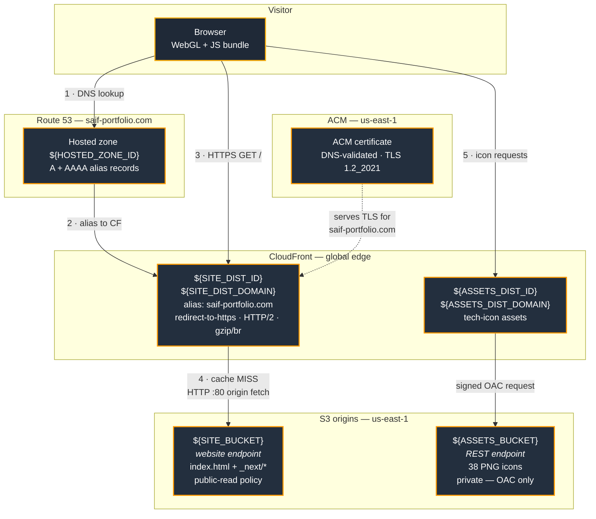
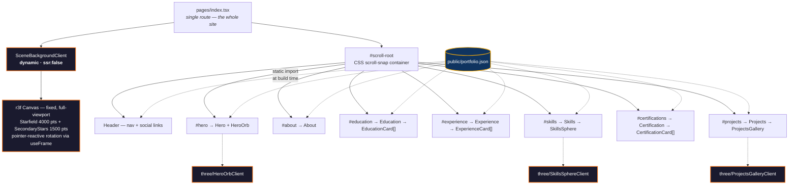
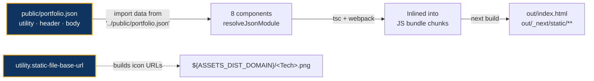
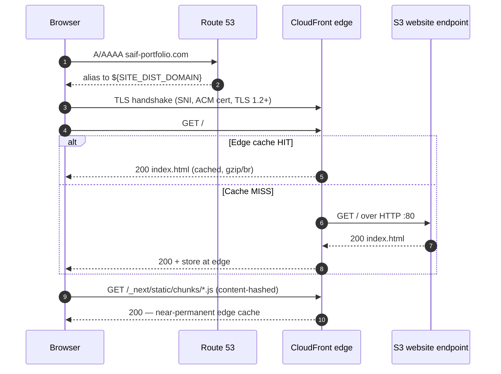
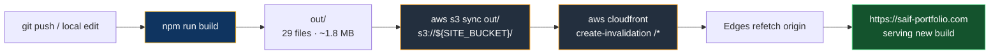

# Saif Ul Haq — Portfolio

An interactive, single-page 3D portfolio built with **Next.js (static export)**, **React Three Fiber**, and **Framer Motion**, delivered worldwide from **Amazon S3 + CloudFront** behind a custom domain.

**Live:** https://saif-portfolio.com

---

## Table of Contents

- [Overview](#overview)
- [Tech Stack](#tech-stack)
- [Architecture](#architecture)
  - [Delivery Architecture](#delivery-architecture)
  - [Application Structure](#application-structure)
  - [Data Flow](#data-flow)
- [Repository Layout](#repository-layout)
- [Local Development](#local-development)
- [Content Management](#content-management)
- [Infrastructure](#infrastructure)
  - [Configuration](#configuration)
  - [Resource Inventory](#resource-inventory)
  - [Network & DNS](#network--dns)
  - [Caching Model](#caching-model)
  - [Security Posture](#security-posture)
- [Deployment](#deployment)
  - [Deployment Pipeline](#deployment-pipeline)
  - [Runbook](#runbook)
- [Operational Notes](#operational-notes)

---

## Overview

This is a **fully static site**. There is no server, no database, and no runtime API. Every page, style, script, and piece of content is compiled into plain files at build time by `next build` (`output: 'export'`), uploaded to S3, and served through CloudFront's edge network.

The visual layer is what makes it non-trivial: a persistent WebGL starfield sits behind the entire document, with additional 3D scenes (an animated hero orb, a rotating skills sphere, a project gallery) mounted per section. All of it is client-only — the 3D code never runs during the static build.

Design consequences of that choice:

| Property | Result |
| --- | --- |
| Hosting cost | Pennies/month — storage + transfer only, no compute |
| Scaling | Handled entirely by CloudFront; origin sees almost no traffic |
| Attack surface | No server-side code to exploit |
| Trade-off | Content changes require a **rebuild + redeploy**, not just a data edit |

---

## Tech Stack

### Application

| Layer | Technology | Version |
| --- | --- | --- |
| Framework | Next.js (Pages Router, static export) | 15.3.2 |
| UI runtime | React / React DOM | 19.1.0 |
| Language | TypeScript (`strict: true`) | 5.8.3 |
| Styling | Tailwind CSS v4 via `@tailwindcss/postcss` | 4.1.10 |
| 3D engine | three.js | 0.186.0 |
| 3D React bindings | `@react-three/fiber` / `@react-three/drei` | 9.7.0 / 10.7.8 |
| Animation | Framer Motion | 12.18.1 |
| Icons & misc | `react-icons`, `react-social-icons`, `react-simple-typewriter` | — |
| Tooling | ESLint 9 + `eslint-config-next`, PostCSS 8 | — |

Built and tested on **Node v22.12.0 / npm 10.9.0**.

### Infrastructure

| Layer | Service |
| --- | --- |
| Object storage / origin | Amazon S3 (static website hosting) |
| CDN & TLS termination | Amazon CloudFront |
| Certificate | AWS Certificate Manager (DNS-validated) |
| DNS | Amazon Route 53 |
| Asset CDN | Second S3 bucket + CloudFront, locked down with Origin Access Control |

All resources live in **`us-east-1`**, AWS account **`${AWS_ACCOUNT_ID}`**.

---

## Architecture

### Delivery Architecture



**Two independent delivery paths:**

1. **Site path** — HTML/JS/CSS from `${SITE_BUCKET}`, exposed through its **S3 static website endpoint**. CloudFront treats this as a *custom* origin (not an S3 origin), talking to it over plain HTTP on port 80. The website endpoint is what provides `index.html` directory-index behaviour and the SPA-style error fallback.
2. **Asset path** — tech-stack icons from `${ASSETS_BUCKET}`, served through a separate distribution using the **S3 REST endpoint with Origin Access Control (`${OAC_ID}`)**. That bucket stays fully private; only CloudFront can read it.

### Application Structure



**The `three/` client-wrapper pattern.** Every 3D component ships as a pair:

```
components/three/SkillsSphere.tsx        <- the actual WebGL scene
components/three/SkillsSphereClient.tsx  <- 7-line dynamic() wrapper, ssr: false
```

Pages import only the `*Client` file. This is required, not stylistic: `next build` with `output: 'export'` prerenders every component in Node, where `window`, `WebGLRenderingContext`, and `<canvas>` do not exist. `dynamic(..., { ssr: false })` keeps three.js out of the prerender pass and out of the initial HTML payload — it loads as a separate chunk in the browser.

### Data Flow



`portfolio.json` shape:

| Key | Contents |
| --- | --- |
| `utility.static-file-base-url` | CloudFront base URL for tech icons |
| `header` | `linkedinLink`, `facebookLink`, `emailLink` |
| `body.hero` | `image`, `profession`, `headlines` (typewriter strings) |
| `body.about` | `img-url`, `description` |
| `body.education` / `body.experience` | `list[]` of entries |
| `body.skills` | 31 named skills with icon/level metadata |
| `body.projects` | 4 entries — `title`, `description`, `tech`, `color` |
| `body.certifications` | 2 entries — `title`, `link`, `expiry`, `icon` |

> [!IMPORTANT]
> `portfolio.json` is consumed via **static ES import**, not `fetch()`. Its contents are compiled into the JavaScript bundle at build time. A copy is emitted to `out/portfolio.json` and uploaded to S3, but **nothing reads it at runtime** — editing that object in the bucket changes nothing on the live site. Content edits always require a full rebuild and redeploy.

---

## Repository Layout

```
portfolio/
├── pages/
│   ├── index.tsx              # the entire site — one route, seven sections
│   ├── _app.tsx               # global CSS injection
│   └── api/hello.ts           # scaffold leftover; not emitted by static export
├── components/
│   ├── Header.tsx             # nav + social links
│   ├── Hero.tsx               # typewriter intro + 3D orb
│   ├── About.tsx
│   ├── Education.tsx          + EducationCard.tsx
│   ├── Experience.tsx         + ExperienceCard.tsx
│   ├── Skills.tsx             + Skill.tsx
│   ├── Certification.tsx      + CertificationCard.tsx
│   ├── Projects.tsx
│   ├── TiltCard.tsx           # pointer-tracking 3D tilt wrapper
│   ├── BackgroundCircle.tsx
│   └── three/                 # ~780 LOC of WebGL, all client-only
│       ├── SceneBackground.tsx / SceneBackgroundClient.tsx
│       ├── HeroOrb.tsx        / HeroOrbClient.tsx
│       ├── SkillsSphere.tsx   / SkillsSphereClient.tsx
│       └── ProjectsGallery.tsx/ ProjectsGalleryClient.tsx
├── public/
│   ├── portfolio.json         # <- all site content lives here
│   ├── favicon.ico
│   └── vercel.svg
├── styles/
│   ├── globals.css            # Tailwind v4 entry + scrollbar/snap utilities
│   └── Home.module.css
├── next.config.js             # output: 'export', images.unoptimized
├── postcss.config.mjs
└── tsconfig.json
```

`out/` and `.next/` are git-ignored build artifacts.

---

## Local Development

```bash
npm install
npm run dev          # http://localhost:3000 — HMR
```

| Command | Purpose |
| --- | --- |
| `npm run dev` | Dev server with hot reload |
| `npm run build` | Static export to `out/` (~1.8 MB, 29 files) |
| `npm run lint` | ESLint via `eslint-config-next` |
| `npm start` | Not meaningful here — the site is a static export |

To preview the real production output exactly as S3 serves it:

```bash
npm run build
npx serve out
```

---

## Content Management

Almost all copy, links, and list data are in **`public/portfolio.json`** — editing that file is the normal way to update the site, no component changes required.

1. Edit `public/portfolio.json`.
2. Add any new icon PNG to the `${ASSETS_BUCKET}` bucket (filename must match the key used in the JSON).
3. `npm run build`
4. Deploy (see below).

---

## Infrastructure

> [!NOTE]
> Concrete account numbers, bucket names, distribution IDs, and zone IDs are **deliberately not committed**. Every `${VAR}` below resolves from `.env.deploy.local`, which is git-ignored. Copy `.env.deploy.example` to `.env.deploy.local` and fill in the real values from the AWS console or CLI.

### Configuration

| Variable | What it is |
| --- | --- |
| `AWS_ACCOUNT_ID` | AWS account hosting the site |
| `SITE_BUCKET` | S3 bucket holding the static export |
| `SITE_DIST_ID` / `SITE_DIST_DOMAIN` | CloudFront distribution serving the site |
| `ASSETS_BUCKET` | S3 bucket holding tech-stack icons |
| `ASSETS_DIST_ID` / `ASSETS_DIST_DOMAIN` | CloudFront distribution serving those icons |
| `OAC_ID` | Origin Access Control granting the assets distribution read access |
| `HOSTED_ZONE_ID` | Route 53 hosted zone for the domain |
| `CERT_ID` | ACM certificate ID for the domain |

```bash
source .env.deploy.local    # exports the variables used throughout this document
```

### Resource Inventory

| Resource | Identifier | Configuration |
| --- | --- | --- |
| **Site bucket** | `${SITE_BUCKET}` (us-east-1) | Static website hosting; index doc `index.html`; **error doc also `index.html`**; public-read bucket policy on `s3:GetObject`; Block Public Access fully disabled (required for the public policy) |
| **Site distribution** | `${SITE_DIST_ID}` | `${SITE_DIST_DOMAIN}`, alias `saif-portfolio.com`; origin = S3 **website** endpoint as a custom origin over `http-only`; viewer policy `redirect-to-https`; compression on; HTTP/2; IPv6 on; `PriceClass_All`; GET/HEAD only |
| **Cache policy** | `658327ea-f89d-4fab-a63d-7e88639e58f6` | AWS managed **CachingOptimized** |
| **Certificate** | `arn:aws:acm:us-east-1:${AWS_ACCOUNT_ID}:certificate/${CERT_ID}` | `saif-portfolio.com`, DNS-validated, `ISSUED`, SNI-only, min TLS `TLSv1.2_2021`, valid to **2027-01-14** |
| **Hosted zone** | `${HOSTED_ZONE_ID}` | `saif-portfolio.com.` — A + AAAA alias to the distribution, plus the ACM validation CNAME |
| **Asset bucket** | `${ASSETS_BUCKET}` (us-east-1) | 38 PNG tech icons; **private** |
| **Asset distribution** | `${ASSETS_DIST_ID}` | `${ASSETS_DIST_DOMAIN}`; S3 REST origin secured by **OAC `${OAC_ID}`**; `redirect-to-https`; default CloudFront certificate |

### Network & DNS



Because the origin is the **S3 website endpoint** rather than the REST endpoint:

- A request for `/` resolves to `index.html` automatically — which is why the distribution's `DefaultRootObject` is empty and the site still works.
- Unknown paths return the bucket's error document, which is also `index.html` — an SPA-style fallback.
- The origin connection is **plain HTTP**: S3 website endpoints do not support TLS. Viewer-facing traffic is still fully HTTPS-only via `redirect-to-https`.

### Caching Model

| Asset class | Path | Cache behaviour |
| --- | --- | --- |
| Hashed JS/CSS | `/_next/static/**` | Filename changes on every content change, so it is safe to cache indefinitely; a new build simply produces new URLs |
| Entry HTML | `/index.html`, `/404.html` | Same URL every build — **must be invalidated** after each deploy |
| Icons | asset distribution | Stable filenames; invalidate only when an icon is replaced |

That asymmetry is the whole reason deploys end with an invalidation: without it, edge nodes keep serving the previous `index.html`, which references the *old* chunk hashes — so a deploy appears to do nothing.

### Security Posture

**In place**

- HTTPS enforced end-to-end for viewers (`redirect-to-https`, TLS 1.2+ minimum).
- Asset bucket is private, reachable only through CloudFront OAC.
- No server-side code, no secrets in the repo, no runtime credentials.
- Only `GET`/`HEAD` are allowed at the edge.

**Known gaps** — deliberate trade-offs for a public static portfolio, listed so they are not mistaken for oversights:

| Gap | Impact | Remediation if wanted |
| --- | --- | --- |
| Site bucket is world-readable, and its website endpoint is reachable directly over HTTP, bypassing CloudFront | Content is public anyway, but the origin can be hit without TLS | Migrate to REST origin + OAC (same pattern as the icons bucket), then re-enable Block Public Access |
| No CloudFront access logging | No traffic or error visibility | Enable standard logs to a dedicated bucket |
| No `ResponseHeadersPolicy` | No HSTS / `X-Content-Type-Options` / CSP | Attach the managed `SecurityHeadersPolicy` |
| No bucket versioning | Deploys are not rollback-able from S3 | Enable versioning on the site bucket |
| Infrastructure is console/CLI-managed | Not reproducible from code | Codify in Terraform or CDK |
| Stale objects from prior builds accumulate | Harmless, slowly growing storage | `aws s3 sync --delete` (see below) |

---

## Deployment

### Deployment Pipeline



Deployment is currently **manual from a workstation** using AWS CLI v2 credentials.

### Runbook

```bash
# 0 - load infrastructure identifiers (git-ignored, not in the repo)
source .env.deploy.local

# 1 - build the static export
npm run build

# 2 - verify credentials point at the right account (${AWS_ACCOUNT_ID})
aws sts get-caller-identity

# 3 - upload
aws s3 sync out/ s3://${SITE_BUCKET}/

#     ...or, to also remove artifacts from older builds:
# aws s3 sync out/ s3://${SITE_BUCKET}/ --delete

# 4 - bust the edge cache
aws cloudfront create-invalidation \
  --distribution-id ${SITE_DIST_ID} \
  --paths "/*"

# 5 - confirm (usually 1-3 minutes)
aws cloudfront get-invalidation \
  --distribution-id ${SITE_DIST_ID} \
  --id <InvalidationId> \
  --query 'Invalidation.Status' --output text
```

`aws s3 sync` sets `Content-Type` from file extensions automatically, so no per-file metadata flags are needed.

**Rollback:** rebuild from the previous commit and repeat steps 1–4. There is no server-side version history — S3 bucket versioning is not enabled.

---

## Operational Notes

- **Deploys without an invalidation look like no-ops.** Hashed chunks upload fine, but cached `index.html` keeps pointing at the old ones. Always run step 4.
- **`--delete` is omitted by default.** Past deploys used plain `sync`, so the bucket still holds hashed chunks and CSS from earlier builds. They cost almost nothing and are never referenced; add `--delete` when you want a clean bucket, understanding that it removes anything not present in `out/`.
- **Adding a new tech icon** means uploading to `${ASSETS_BUCKET}` *and* invalidating `${ASSETS_DIST_ID}` if you replaced an existing filename.
- **`pages/api/hello.ts`** is scaffold residue. Static export produces no API routes; the file is inert but could be deleted.
- **ACM renewal** is automatic while the DNS validation CNAME stays in the hosted zone — do not delete that record. The current certificate is valid through **2027-01-14**.
- **WebGL is required.** Devices without it lose the 3D scenes; content sections still render, since they are ordinary DOM.
